# 插件配置

## Gittalk

这个不一定最先配置，我也不建议你最先配置这个，这个最好最后配置。

我把这个的配置写在第一条，是因为我在这折腾了很久，就是因为网上抄来抄去的答案，除了迷惑我难以给我提供帮助。

摆脱，缺斤少两的答案为什么抄来抄去？我也不喜欢别人转载我的文章，如果我日后那天发现了Bug更新了，转载我文章的人肯定不会跟着更新……然后……

我的配置经验是根据自己情况写的，受时间（不同时间来配置，也许使用版本不同）等复杂因素，不一定适合每个人，所以再看本文时，最重要的是关注问题的分析思路。


首先看[gittalk的官方描述](https://github.com/gitalk/gitalk)

第一个是引入的问题。

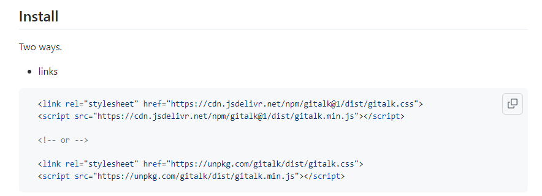

官方用的公共CDN有时候会被墙，导致访问失败，所以我更换了为了如下：

```html
<!-- 评论-->
<link rel="stylesheet" href="//unpkg.com/gitalk/dist/gitalk.css">
    <script src="//unpkg.com/docsify/lib/plugins/gitalk.min.js"></script>
    <script src="//unpkg.com/gitalk/dist/gitalk.min.js"></script>
```

然后就是配置问题

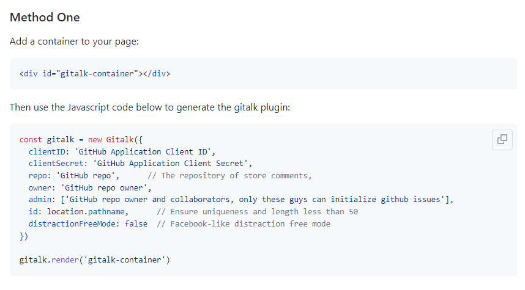

不着急啊，咱们一个一个来看

首先是要填写的配置项

```js
const gitalk = new Gitalk({
  clientID: 'GitHub Application Client ID',
  clientSecret: 'GitHub Application Client Secret',
  repo: 'GitHub repo',      // The repository of store comments,
  owner: 'GitHub repo owner',
  admin: ['GitHub repo owner and collaborators, only these guys can initialize github issues'],
  id: location.pathname,      // Ensure uniqueness and length less than 50
  distractionFreeMode: false  // Facebook-like distraction free mode
})
```

这个里面的配置项，怎么填，网上一大把，你就搜docsify配置gittalk，文章开始全都是教你配置的，所以，自己去百度。下图是[网上随便搜的一篇配置教程]([Gitalk 与 docsify 的结合 - 知乎 (zhihu.com)](https://zhuanlan.zhihu.com/p/379071030))

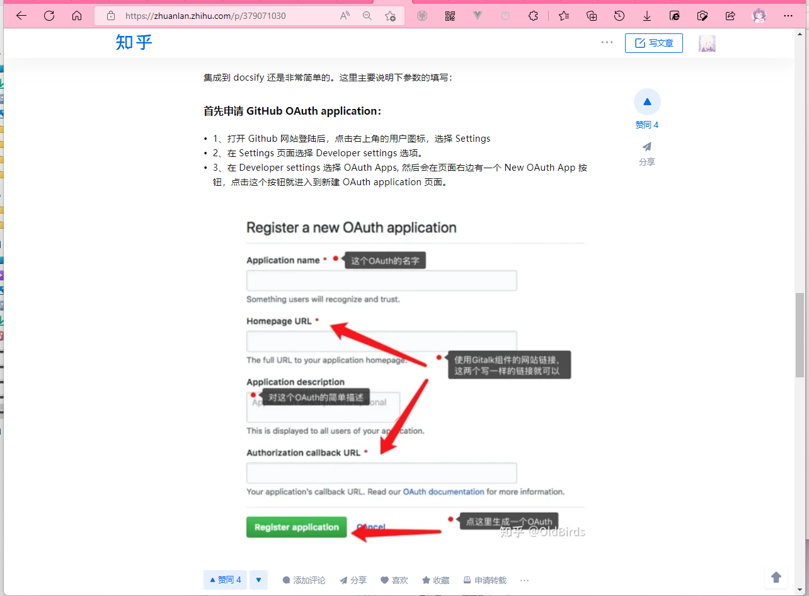

我的填写如下：

```js
var gitalk = new Gitalk({
    clientID: '申请到的ID',
    clientSecret: '申请到的密钥',
    repo: '仓库名称（存放评论的仓库名称）',
    owner: 'Github用户名',
    admin: ['Github用户名，必须要用这个用户来初始化评论的。'],
    id: location.pathname,
    // facebook-like distraction free mode
    distractionFreeMode: false,
})
```

这个配置可能存在全部页面的评论都相同的情况，后面再解决。

基本网上的配置教程就这样了，然后就去讲启用过程的问题了。

摆脱，认真看看代码

var gitalk = ……

设置了变量，又不用，那不是闲的吗。看官方文档

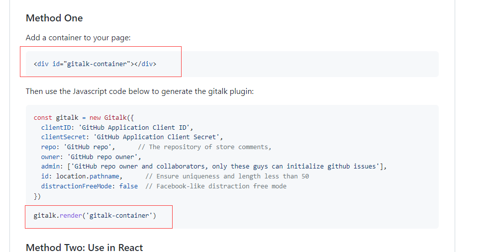

还差个绑定页面元素初始化成评论区对吧。

这时候问题来了。我docsify在index.html的那个地方写`<div id="gitalk-container"></div>`

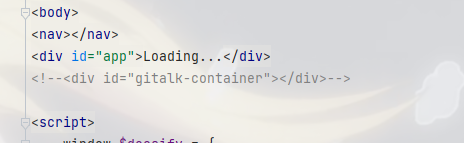

上图被我注释掉的就是我之前写的位置。这不成啊，显示有很大的问题。

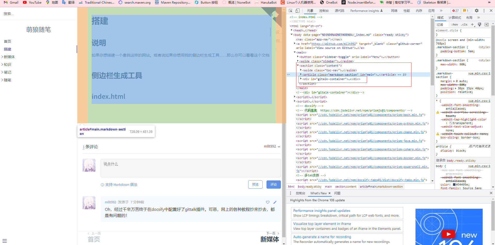

于是我查审元素，定位到了文章区域，是不是应该插入到文章末尾？

页面上的元素都是加载出来的，你最开始没有，index.html里面没有这些元素对吧

你上哪添加去？

于是我就想到了用js添加元素

```html
<script>
    window.onload = function () {
        var gitalk = new Gitalk({
            clientID: 'id',
            clientSecret: '密钥',
            repo: 'note',
            owner: 'mllt992',
            admin: ['mllt992'],
            id: location.pathname,
            // facebook-like distraction free mode
            distractionFreeMode: false,
        })
        var ele = document.getElementsByClassName('toc-nav')[0]
        var newele = document.createElement('div')
        newele.id="gitalk-container"
        ele.parentNode.insertBefore(newele, undefined)
        gitalk.render("gitalk-container")
    }
</script>
```

我简单跟你说一下这个js的写法，你不会没关系，理解我说的就行。

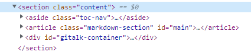

我们要在``section`标签内的最后，插入我们想插入的元素。

我首先要获得``section`的某个子元素`var ele = document.getElementsByClassName('toc-nav')[0]`

> 通过样式名获取得到的是一个列表，因为只有这个地方用例`toc-nav`这个样式，所以索引是0，你在选择的时候别选那些出现了很多次的class名，容易出错。

再看我们需要的`<div id="gitalk-container"></div>`，一个id为`gitalk-container`的div标签对吧。

那么我们先创建div标签：`var newele = document.createElement('div')`

然后设置id：` newele.id="gitalk-container"`

然后插入：` ele.parentNode.insertBefore(newele, undefined)`

写undefined的话，插入位置就是在ele元素的父元素里面的最后插入。

也就是跟ele元素同级，并且在同级元素中，最后位置插入

如果你看不懂我说的，可以看看这篇文章[Node.insertBefore()](https://developer.mozilla.org/zh-CN/docs/Web/API/Node/insertBefore)

生成元素后，就可以将这个元素初始化为评论区了

`gitalk.render("gitalk-container")`

然后成功之后你会发现那个样式还是存在点问题，所以需要我们结合实际情况调一下样式，例如宽度，边距等。

例如我设置宽度为95%

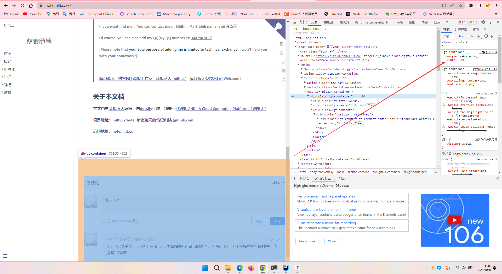

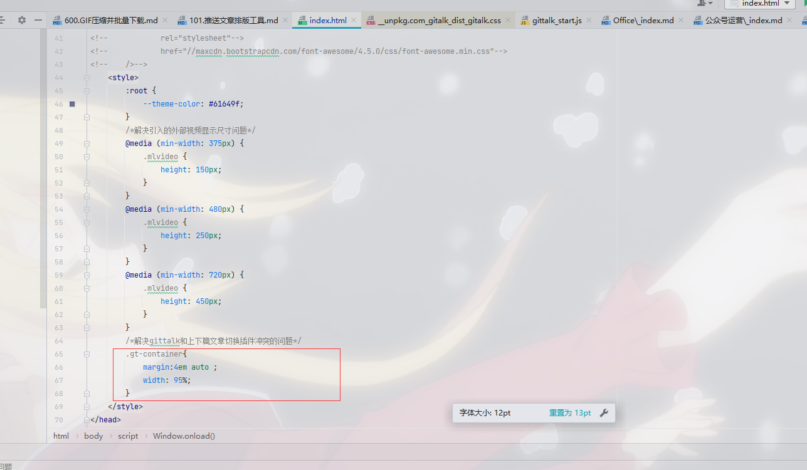

你可能会好奇，我怎么知道就是在`.gt-container`里面设置样式

1.你去看看你引入的CSS文件。观察观察就知道了。

2.查审元素一查，你想改啥元素样式那还是轻轻松松。

配置到这里就完了，基本配置。当然可能还有很多需要优化的地方，这个慢慢来吧。

然后关于加载评论区Network的问题：它说**未找到相关的issues进行评论**，让你初始化啥的，你点击蓝字，登录github，加载了一会，跟你说network ……大概意思就是网络有问题。

网上有很多方法解决，什么代理反代理，我看着就觉得烦。于是我利用科学，绿色上网，搭配下面这个软件

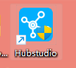

这个软件相当于conda对python进行环境隔离，而他是对网络环境的隔离，姑且那么理解吧

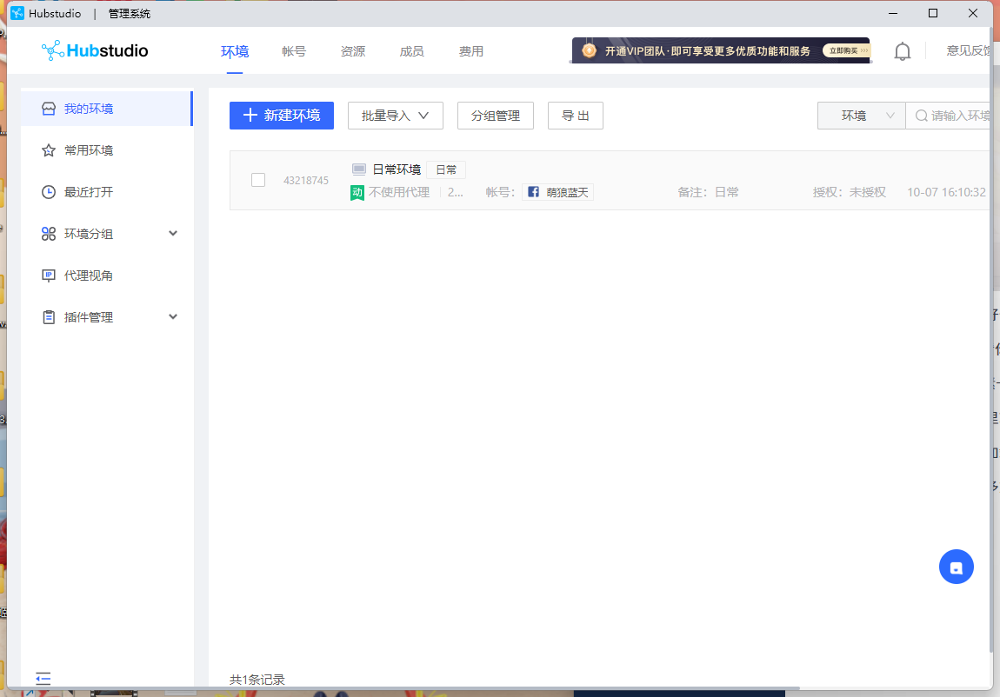

打开这个环境，访问你的网站，然后点击文字初始化issues，登录github，就ok了

不会出现那啥网络问题了。


只要初始化了，后面普通网页也能用了，不过我寻思着，普通人有时候github都打不开呢。算了，得过且过吧。

你要是愿意，把评论区存储到自己服务器啥的，可以自己搞个评论系统。

先到这里吧，后面有啥觉得指的分享的就继续更新。