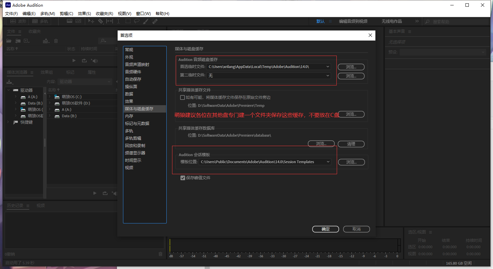

# Audition简单介绍

## 发在哔哩哔哩上的公开教程

### Audition | 认识Audition，用audition录音，调节音量，合成伴奏

<iframe src="//player.bilibili.com/player.html?aid=803365442&bvid=BV1uy4y137L6&cid=346063824&page=1" scrolling="no" border="0" frameborder="no" framespacing="0" allowfullscreen="true" height="100%"> </iframe>

### Audition | 给干音合成伴奏（1）认识3个按钮，剪切与删除音频，导出作品等

<iframe src="//player.bilibili.com/player.html?aid=630870191&bvid=BV13b4y1Z7MZ&cid=346061386&page=1" scrolling="no" border="0" frameborder="no" framespacing="0" allowfullscreen="true" height="100%"> </iframe>

下面这个是很久以前录的了，不建议观看

<video class="centeredVideo" controls="" width="100%" height="auto" src="https://pan.mllt.cc/files/video/omtpcedu/音视频/Audition简单介绍.mp4">
        浏览器版本过低，换个浏览器行不你个老六！
</video>

## Audition设置

###  1.音频硬件设置 

**当你更改了音频硬件的时候（比如插入耳机，拔出耳机等）都需要修改音频硬件的设置。**

编辑——>首选项——>音频硬件——>更改输入输出的音频设置

###  2.缓存文件的设置

编辑——>首选项——>媒体与磁盘缓存

###  3.其他

其他的设置和快捷键设置自己摸索（建议大家看看快捷键的设置 编辑——>快捷键）
