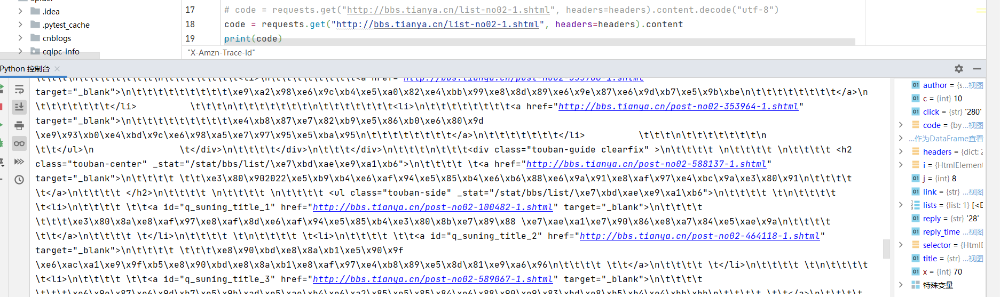
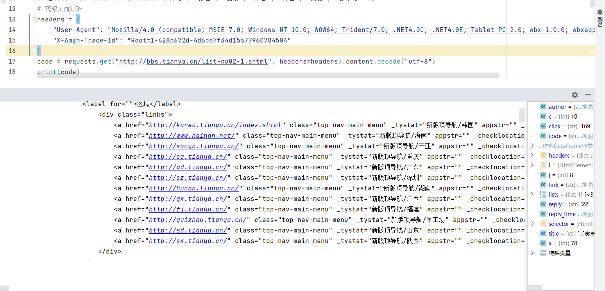
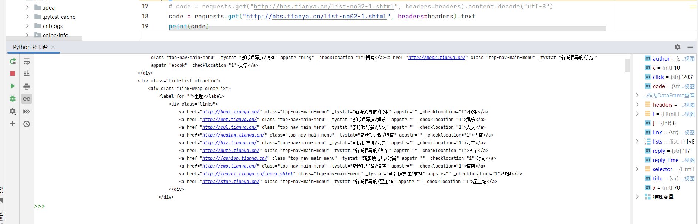
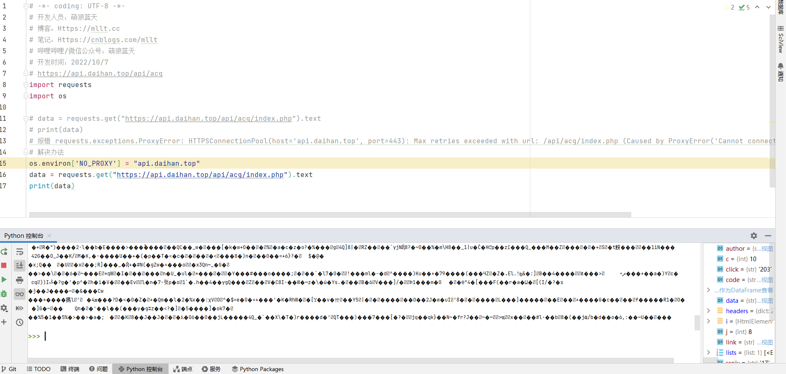
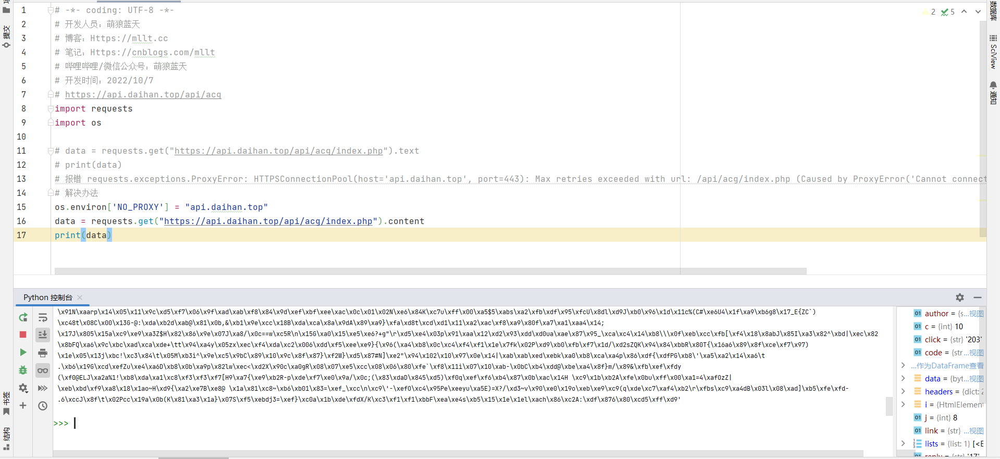
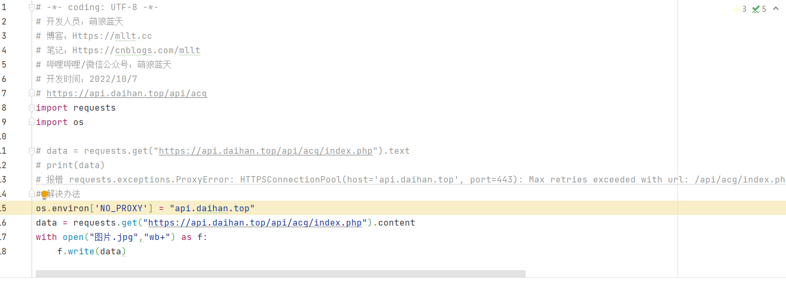

# 爬虫问题：requests的content和text

通常来说，text获取的是Unicode编码的文本数据，content获取的是byte类型的二进制数据，比如获取图片本身、PDF文件之类的，可以用content。

但是有时候，我们使用text获取文本的时候，会出现一些难以解决的编码问题，这个时候，我们可以使用content.decode("utf-8")。

仅仅使用content，出现很多`\x...`，要让它正常显示，**因为这些内容原本是文本内容**，所以可以使用decode以utf-8形式编码

​

当然，像这个网页比较简单，没什么乱七八糟的东西，用text也没啥问题

​

那比如我想获得一张图片文件，如果用text的话（肯定是不合理的，**因为这个是一张图片，而不是文本**）

我们可以用content获取到图片本身的二进制数据，然后利用这些二进制数据写出为图片文件

保存为图片文件

​

​

> 注意：这是别人免费的API，别去爬。
>
> 要是你测试的请求一两次吧还可以，但如果你要频繁测试的话最好别用这些小本经营的免费API网站
