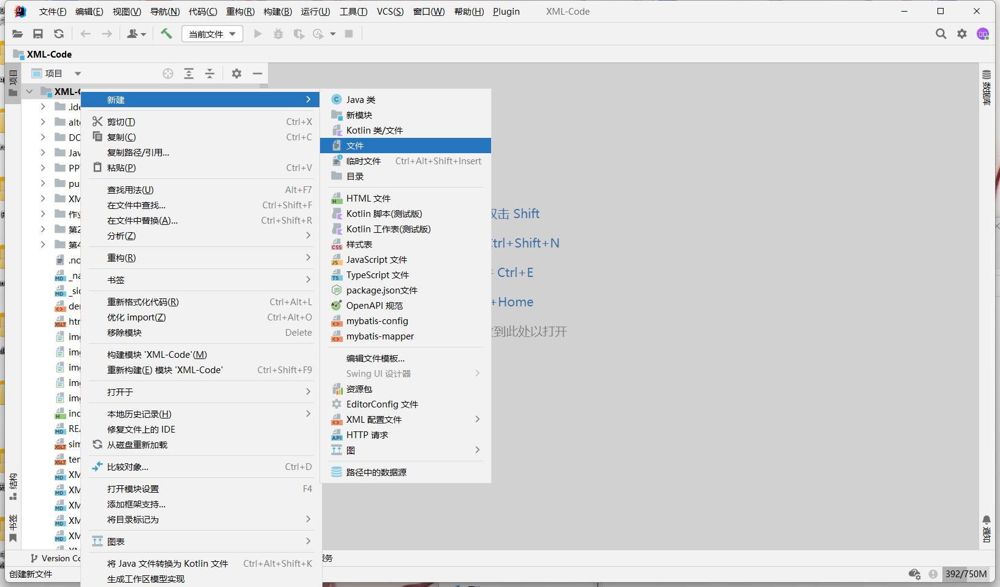

# 准备

 > 在这一节，你将会学习到一些基础的不能再基础的技能。

你要知道，我们开发一个程序/网站，如果没有开发文档，那么是非常不利于后面的维护的，毕竟谁也不记得自己三个月前写过啥代码，为啥要那样写。

你要知道，我们学了那么多编程语言，那么多杂七杂八的知识，肯定都不可能完全记住的

你要知道，你现在遇到的错误解决了，你下次还可能会遇到。

所以你需要什么？你需要写笔记！接下来，我会告诉你，作为一个程序员该怎么去写笔记。

## 一、学会写博客

### （一）markdown

我们写的笔记，会涉及到大量的代码、截图，如果你在word中编写，会变得十分的困难和丑，所以，你需要学会使用``markdown`书写笔记。本文就是使用`markdown`编写的。

`markdown`是什么？markdown是轻量级的标记语言，你可以理解为一种书写规则。

先贴上官方使用文档，但是不要着急去看官方文档，继续阅读本文

> [Markdown 基本语法 | Markdown 官方教程](https://markdown.com.cn/basic-syntax/)

接下来就是你的动手时间了。不管你用Idea、Webstorn、Pycharm、Vscode，都可以编写`markdown`文档。

接下来我会演示在Idea中书写markdown文档，而你的练习就是能在Pycharm中书写markdown文档，进一步的，能通过为vscode安装相关支持插件，在vscode中书写markdown文档。

非常简单

新建一个文件，扩展名写`.md`即可

> 如果IDEA提示你需要安装相关的依赖插件的时候，安装即可。

在idea中，markdown有三种预览模式，我们选择中间的编辑+预览模式，然后尝试输入以下内容，你看看预览出来的效果。

去试一试吧。我只是演示了常用的，如果你想了解更多，现在可以去看官方中文文档了。

> [Markdown 基本语法 | Markdown 官方教程](https://markdown.com.cn/basic-syntax/)

### （二）选择写博客的平台

你在学习过程中写的笔记，如果是存在自己的电脑，是不是容易找不到？

不方便检索笔记内容？

容易丢失？

所以我一般都会上传到博客平台例如CSDN、博客园、知乎、简书、稀土掘金。

我个人的笔记是上传博客园，然后通过博客园自动同步到CSDN。

如果你对写博客不了解，我建议你先去CSDN写博客。

稍微熟悉点了，再去折腾博客园（因为博客园支持自定义美化吖，还没有广告，比CSDN强多了）

> [(萌狼蓝天) CSDN - 专业开发者社区](https://blog.csdn.net/ks2686)
>
> [(萌狼蓝天)博客园](https://www.cnblogs.com/mllt/)

下面以CSDN为例

> oh,我看到了，如果你直接点右上角的创作中心也可以的……

在博客设置中奖编辑器设为markdown编辑器

关于博客的具体使用自己摸索啦。在编辑器里面可以导入我们的本地markdown文档

看到这里就够了。

## 二、学会Git

What's git？有兴趣自己去百度下了解它概念。

当然，不管你理不理解百度百科对它的介绍，我们总归是要使用它的。

对目前的我们来说，它的可以拿来备份我们代码。

所以你现在只需要怀着：“利用git将代码存放于代码托管平台，进行备份”的目的，就可以了。

那么我们有两个平台可以选择

* https://gitee.com/mllt992

* https://github.com/mllt992

Gitee是中文的，适合刚学习Git的同学使用，Github是外国的，因此全英文，而且有时候进不去，需要科学上网。

所以在学习阶段，可以先去使用Gitee。

现在你就要思考一个问题，我怎么样把我的代码放到Gitee里面去

互联网上教程非常多，你只需要利用搜索引擎搜索一下，就能看到很详细的图文教程。

> ####  Git 的下载与安装:
>
> https://blog.csdn.net/fzx1597965407/article/details/124371720
>
> (我在网上随便找的)

这是对你的一个小考验：

- [ ] 在Gitee中新建仓库
- [ ] 将本地代码文件删上传到Gitee仓库中
- [ ] 在本地修改代码文件内容，然后利用命令更新到Gitee仓库

要求：完成上述任务，并形成自己的笔记，发布在博客园。