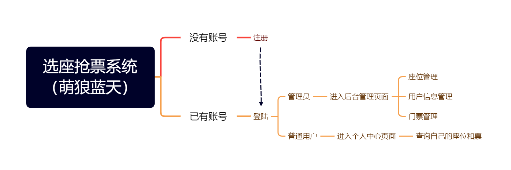

# 设计

这并不是说图像方面的设计，而是关于一个系统的设计。

是的，你将要要做一个项目，但是这个项目具体是什么呢？

我们要提前确定好项目的内容，然后对项目进行设计，然后再进行开发。

如果想简单一点吧话，那就是xx管理系统了，不过是增删改查的管理系统最基础了。

## 一、要做什么

那么你会想做一个什么样的项目呢？也许你现在并不知道，以下内容也许会给你提供一点建议：

* 从功能角度来看，我们主要做的功能也就是增删改查的项目。那么这个项目的复杂度不会太高。增删改查可以实现什么项目呢？用户管理系统、宠物管理系统、图书馆管理系统……（一听就知道烂大街的项目）
* 我总是忘记我的东西在哪里，因此可以做一个物件管理系统，这个系统记录了什么东西在什么地方，我可以快速查询。
* 账号密码管理系统！
* 一个简单的个人博客！
* ……

你先想想，你想要做什么。毕竟我想出来的项目，具体内容怎么去设计只有我才知道。

如果你实在不知道做什么，那我给你个建议：

1级（新手练习）：用户管理系统，能对用户信息增删改查，就这样。

2级（学期测试）：商品管理系统，有商品、商品类型、订单等信息，他们之间相互关联，在做的时候要考虑关联性的问题。

3级（综合练习）：做一个原创管理系统项目


我在上学年的时候，元旦前给学院用C#写了一个元旦选座抢票的系统，你可以先去看看

如果不知道做什么的话，那你就用java做一个选座抢票系统吧。

https://www.bilibili.com/video/BV1KD4y1c7dM/

当时是C#（.Net framework）+ Bootstrap + MySQL就做出来了，还是比较简单。

## 二、从哪开始设计

请在想好要做一个什么系统的时候再来看。

### （一）确定要开发的系统功能

现在你已经确定好要做的系统了，那你的系统有些什么功能呢？

例如我要做一个选座系统

* 用户可以注册登录
* 用户可以查询剩余座位并选座
* 用户选座后生成门票，用户可以查询自己的门票
* 管理员可以查询用户选票状况
* ……

> 我认为我不该把所有的想法都写上来，这会阻碍你思考，应当由你自己去设计，去做一个具有独特性的系统。




你想好之后用思维导图工具简单的画个图，让自己更明晰要开发的功能。

如果你在做毕业设计的话，在这一步需要做大量的软件工程的设计工作，绘制UML图、编写用例文档等

### （二）根据功能，设计数据库

数据存储是至关重要的，做系统嘛肯定少不了数据库，你可以使用MySQL或者MongoDB

但不管怎么样，你都需要提前设计好数据库。

* 你的系统需要什么表单？
* 你的表单应该有什么字段？
* 表单和表单之间的关联？

对于数据库的设计的规范和注意事项，请参考阿里巴巴Java开发手册（嵩山版）

```pdf
/public/res/阿里巴巴Java开发手册嵩山版.pdf
```

对于数据库设计过程中的命名问题，尽可能的按照手册上的规范进行命名

在后续开发中，如果你能尽可能的贴合手册规范，那挺好的。

## 温馨提示

设计这一环节不可缺失，在设计时尽可能考虑全面。

毕竟你开发到一半了，发现缺个字段，修改起来是非常麻烦的。

> [推荐阅读]
>
>    [【实训总结报告】大二下学期期末Java EE实训报告 ](https://www.cnblogs.com/mllt/p/doc_20220707.html)


abc