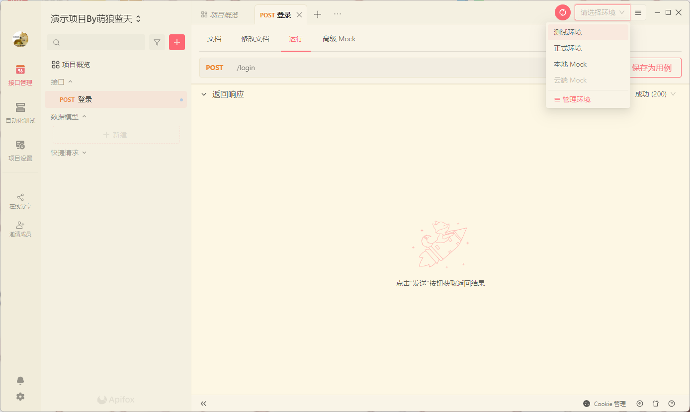

# 前后端的通信

前端和后端是如何进行通信的？

比如我在前端登录，后端怎么收到前端的登录请求？

后端又怎么把登录成功或者失败的信息返回到前端？

前端又如何读取后端的返回的信息？

## 请求

* POST 和 GET 两种提交方式的异同
* JavaScript原生提交POST请求
  * [AJAX 教程 | 菜鸟教程 (runoob.com)](https://www.runoob.com/ajax/ajax-tutorial.html)
* Jquery提升POST请求
  * [jQuery post() 方法 | 菜鸟教程 (runoob.com)](https://www.runoob.com/jquery/ajax-post.html)
* axios（在Vue中使用）提交POST请求
  * [Axios 中文文档 | Axios 中文网 | Axios 是一个基于 promise 的网络请求库，可以用于浏览器和 node.js (axios-http.cn)](https://www.axios-http.cn/)

你不必马上就去看，你只需要知道我在这里给出了相关文档，到时候需要用的时候记得回来查。

## JSON

一般数据的传输都是使用JSON格式进行传输

所以你要知道JSON的格式是什么样的格式。

[JSON 教程 | 菜鸟教程 (runoob.com)](https://www.runoob.com/json/json-tutorial.html)

前端如何提交JSON请求，如何解析后端返回的JSON数据

后端如何接收/返回JSON数据

## API管理工具

> 现在你还没开始写代码，也就是没有后端，没办法调试API
> 所以你先看看，等你把后端API写了之后再回来学习使用API管理工具

现在，你的Java后端API开发完毕了，可是你还没有前端

你怎么测试你的API是可用的，没有问题的呢？

我们想测试这些API接口，也就需要向后端提交POST请求对不对

可是让我们自己编写js代码提交POST请求，效率太低了

我们需要借助一款工具，帮助我们测试接口没得问题，同时生成后端API接口文档

当我们测试完接口后，文档也有了，前端开发人员就可以根据这个文档编写请求了。

API测试管理很多，有PostMan、apiFox等等

我用的是apiFox

下载地址：[Apifox - API 文档、调试、Mock、测试一体化协作平台 - 接口文档工具，接口自动化测试工具，接口Mock工具，API文档工具，API Mock工具，API自动化测试工具](https://www.apifox.cn/)

### 新建项目

创建完成后点击即可进入管理界面

### 新建接口

填写信息，填写完毕后保存

### 测试接口

点击右上角运行按钮，如果你没设置环境，要先去设置环境

点击右上角的`请选择环境`，如下图，点击管理环境

如果你是本地测试，那就是`http://127.0.0.1`，你也可以改成`http://localhost`

最关键的，是要添加端口号

当然这个端口号不是乱写的，你看看你Java后端运行起来后的端口号是多少，填进去。

然后保存关闭，然后选择环境为测试环境，运行即可

